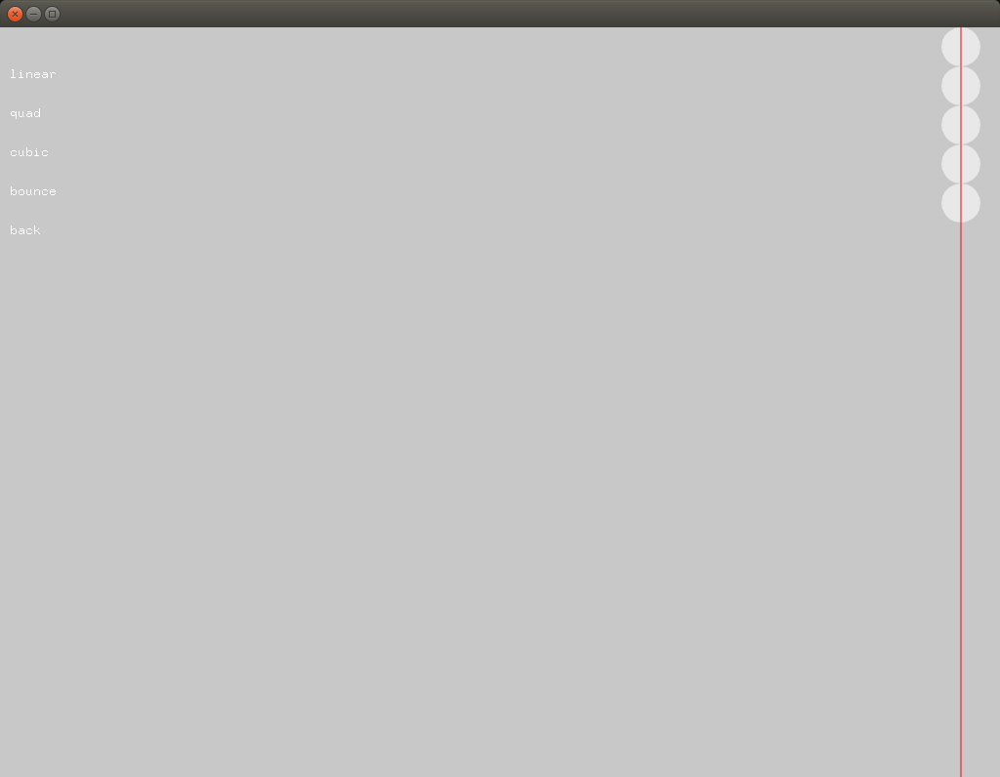

### Description

Learn easing equations and object oriented programming.

### What did you learn
How to use easing equation to move things around. What is an addon, how to add it to a project using the project generator.

### Exercise(s)
In the example, the updatePosition method moves the ball from left to right.
Can you imagine other ways to move the balls reading the values contained in the positions vector?

Try to make the application more colorful. Read this [article](https://www.patreon.com/posts/colors-colors-18611429?utm_medium=social&utm_source=twitter&utm_campaign=postshare) about colors by [Manoloide](https://twitter.com/manoloidee)

Read the article linked in the references.

### References
[Robert Penner](http://robertpenner.com/easing/) and the easing equations.

[Object Oriented Programming](https://openframeworks.cc/ofBook/chapters/OOPs!.html)

