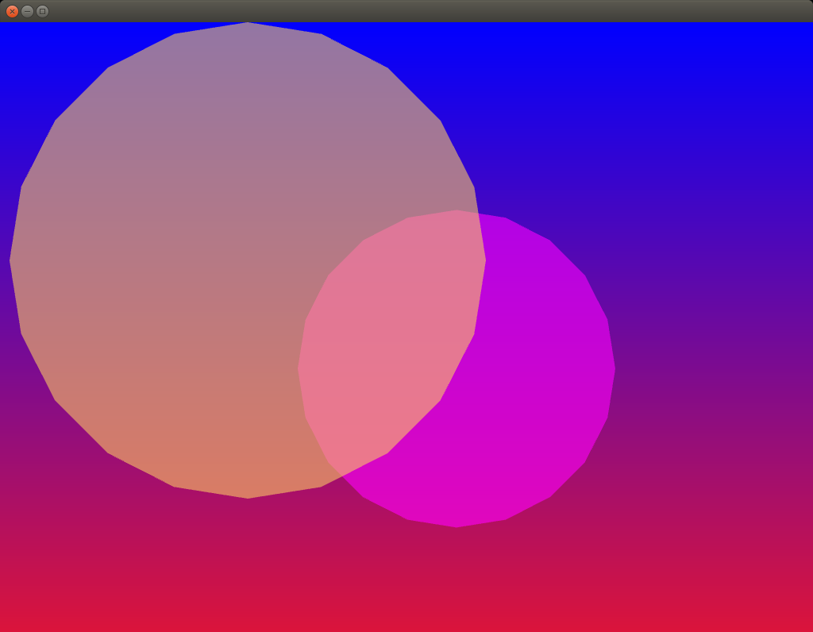

### Topics
Colors and principles of Object Oriented Programming.

### Description
Intro to c++, intro to classes, objects, properties and methods. Intro to openFrameworks and the main loop. How to create an object, what is a constructor, how to move it using easing functions.

### What did you learn
The openFrameworks loop, `setup`, `update` and `draw`. What is a class, why it is called `object`. What is a header file and what goes into it.
Create a color using `ofColor` or `ofFloatColor::red`. How to draw a circle using `ofDrawCircle`, what is a vector and which are its properties. How to move a things around using a vector.

### Exercise(s)
Check the documentation about [graphics](https://openframeworks.cc/documentation/graphics/) and try to draw others forms instead of circle. Create a class for this forms.

Make a compelling composition just playing with the background color, the color of the objects and the transparencies.

### References
[The Interaction of Colors](https://www.goodreads.com/book/show/111113.Interaction_of_Color) by Joseph Albers.

[Intro to graphics](https://openframeworks.cc/ofBook/chapters/intro_to_graphics.html)
