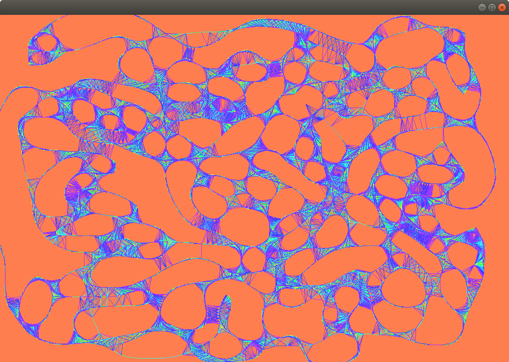

### Topics
Lines and noise

### Description
This app uses the mouse interaction to collect points. These points are stored in an `ofPolyine` object.

### What did you learn
How to use `ofPolyline` to draw a line. How to add new elements to it. After the exercises and the lesson in class, you will have a solid understanding of what noise and random are.

### Exercise(s)

Read the chapter about lines in the [ofBook](https://openframeworks.cc/ofBook/chapters/lines.html).

Make an application where the points collected by the mouse movement are affected by the `ofRandom` function, as explained in the guide.

Check these 3 examples:
- [noise1dExample](https://github.com/openframeworks/openFrameworks/tree/master/examples/math/noise1dExample)
- [noise1dOctaveExample](https://github.com/openframeworks/openFrameworks/tree/master/examples/math/noise1dOctaveExample)
- [noised circles](http://junkiyoshi.com/insta20180602/)

Make an application that draw lines, circles or whatever you want, using the `ofSignedNoise` function.

### Credits
This app comes from the repository [VAW_workshop](https://github.com/ofZach/VAW_workshop/tree/master/drawingWorkshop), by Zach Lieberman.
