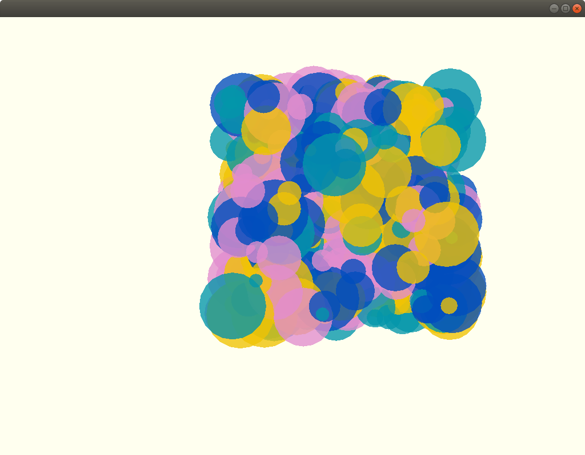

### Topics
The c++ vector container and the RGB and HSB color spaces.

### Description

This app is an introduction to vectors as containers. You will use the Circle class and the penning equations from the previous sketches to build a composition of circles that moves around following your mouse.

### What did you learn?
How to add and edit elements in a container, how to create colors in RGB and HSB, how to define a palette of colors, how to animate the element in a container, how to modify them. What is an `map` and how you can use it to create a color palette.

### Exercise(s)

Create your own palette, invent your own animation. Read the two references regarding `std::maps` and `std::vectors`.

### References
[The Interaction of Colors](https://www.goodreads.com/book/show/111113.Interaction_of_Color) by Joseph Albers.

Colors suggestion by [Manoloide](https://www.patreon.com/posts/colors-colors-18611429)

[std::map](https://openframeworks.cc/ofBook/chapters/stl_map.html) documentation

[std::vectors](https://openframeworks.cc/ofBook/chapters/stl_vector.html) documentation
