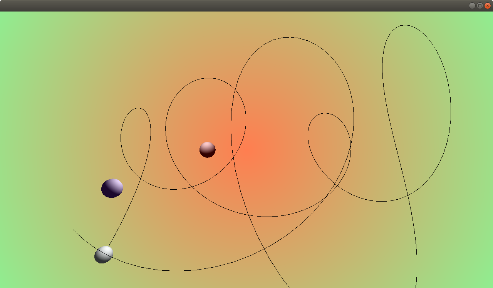

### Topics
3D and sounds

### Description

In these apps three planets turn around each other an make sounds.

### What did you learn
What are the elements that you need to draw a 3D scene, what is an `ofMaterial` and which parameter it accepts. What is a graph scene, what is an `ofNode` and how is it possible to chain objects together. How to play sounds.

### Exercise(s)
- check the example `examples/3D/Primitive3D` and make an app that uses other primitives than the sphere
- Add a GUI that allows you to change the number of points that you want to keep in the ofPolyline. Add other parameter to the GUI, like colros
- Check the [BBC sound archive](http://bbcsfx.acropolis.org.uk/) and make new sounds.
- Have a look at the documentation of [ofMaterial](https://openframeworks.cc/documentation/gl/ofMaterial/), in particular to the method:  setDiffuseColor(),setEmissiveColor(),setShininess(),setSpecularColor() and setAmbientColor().  Can you make a specular material? how? can you call this functions on the same material? how does the material change, when you change the color of the light?
- Add more lights an make them move.
- Read the article linked in the references. You do not need to understand everything on in at the moment, focus on the first part of it, until "Why -1 to 1?" included

### References
[ofBook about sound](https://openframeworks.cc/ofBook/chapters/sound.html)

