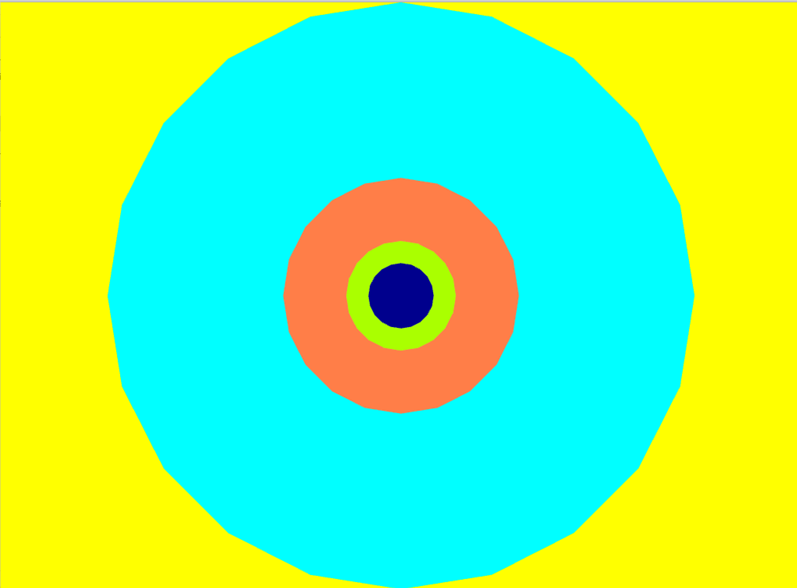

## Instructions

In order to get this sketch running, download [Sonic PI](https://sonic-pi.net/). Open it and copy and paste this text on it:


```ruby
live_loop :foo do
  use_real_time
  a, b, c, d= sync "/osc/trigger/prophet"
  synth :tb303, note: a, attack: b, sustain: c*0.5, release: d
end
```

When you are done, press the play button on the top-left corner of the screen. After that, launch the OF application. When the small circle touches the big one, you should here a sound

### Topics
OSC, synthesizers basics, geometric forms.

### Description
Making sound with Sonic PI and openFrameworks.




### What did you learn
How to use the OSC protocol to "talk" with other applications, what is a synthesizer and what does it mean "ADSR".

### Exercise
- Make a short animation with images, color and sound.
- Read chapter 1 "Welcome to Sonic PI" and "Synths" of the sonic PI documentation.


### References
[Sonic PI and OSC](https://github.com/samaaron/sonic-pi/blob/master/etc/doc/tutorial/12.1-Receiving-OSC.md)

[John Whitney, "Catalog" 1961](https://www.youtube.com/watch?v=TbV7loKp69s)
[John Whitney, matrix 3](https://www.youtube.com/watch?v=ZrKgyY5aDvA)
[John Whitney](https://en.wikipedia.org/wiki/John_Whitney_(animator))
