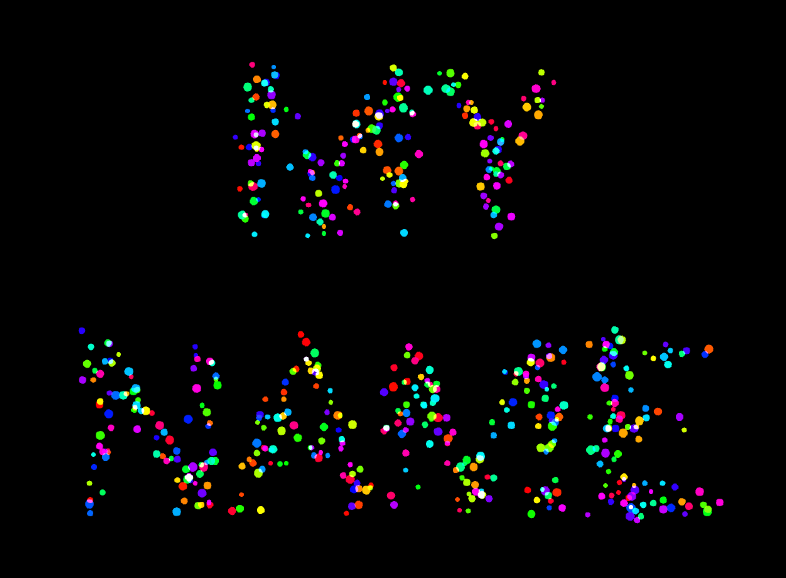

### Topics
Fonts, pixels, random and noise

### Description
Manipulate fonts.

### What did you learn

### Exercise
- Make your own `draw` method, as `drawPoints` and `drawPointsConnected`
- Run the fonts examples in your OF installation
